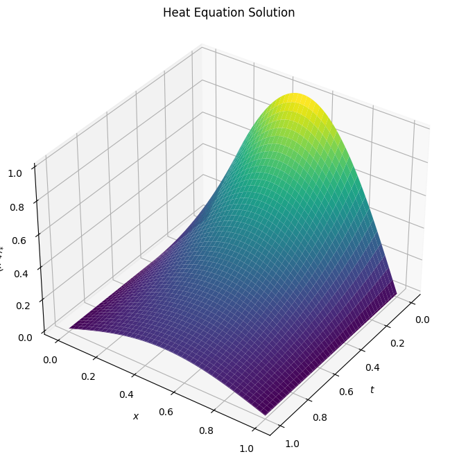
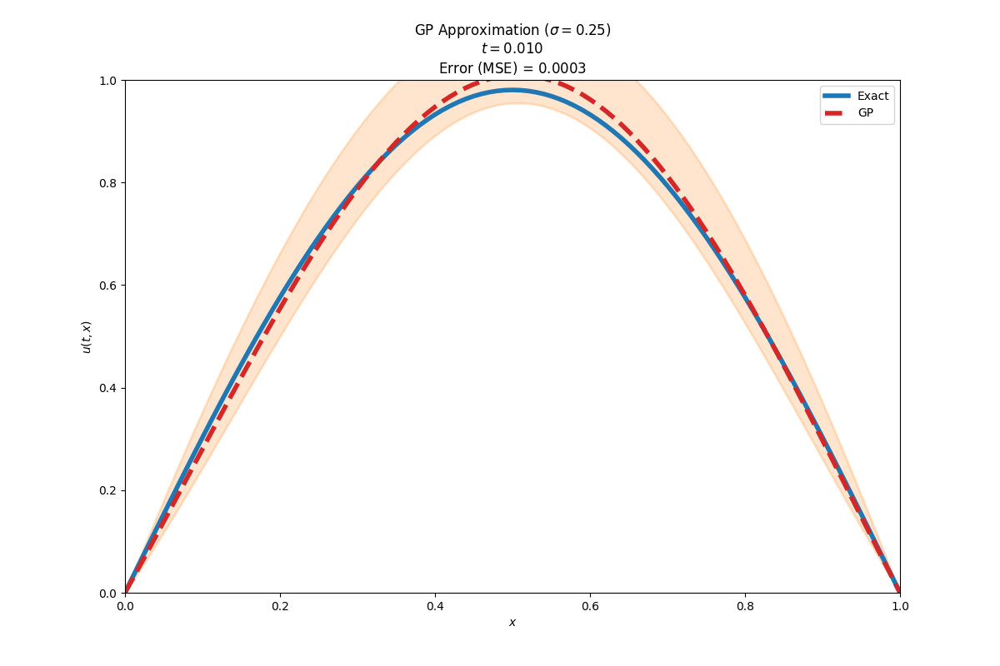
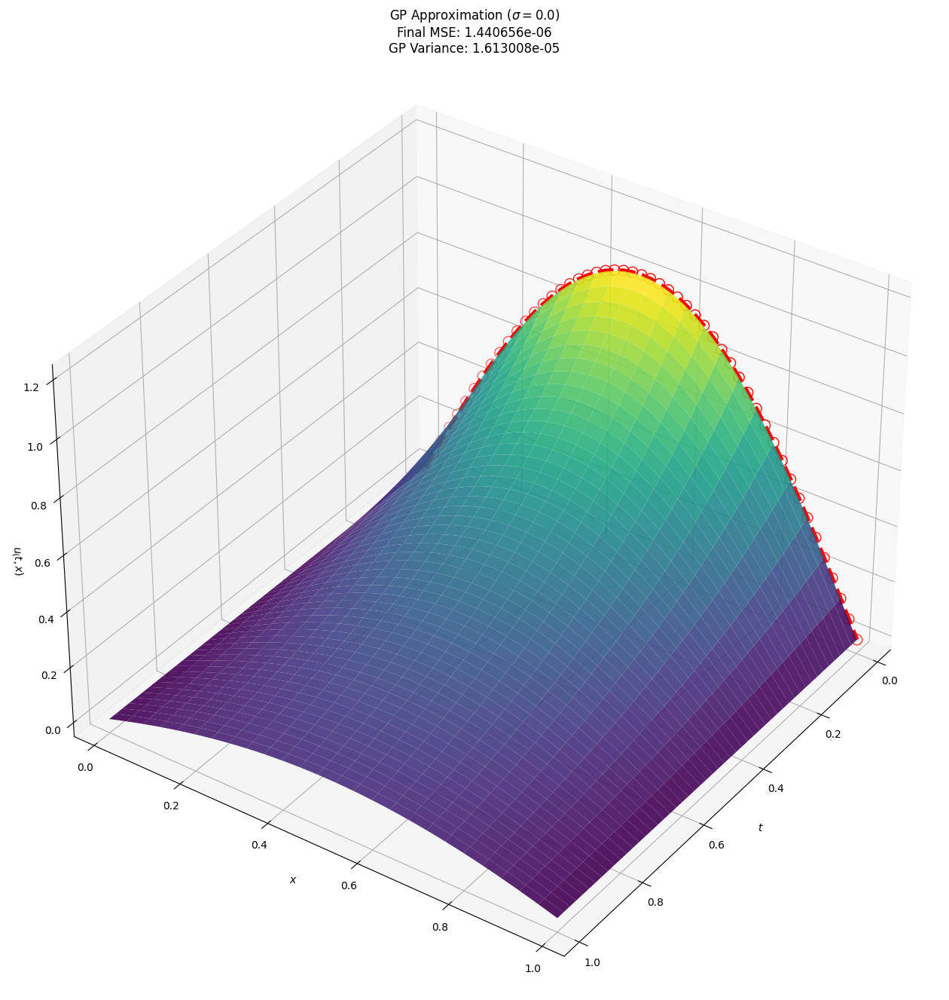
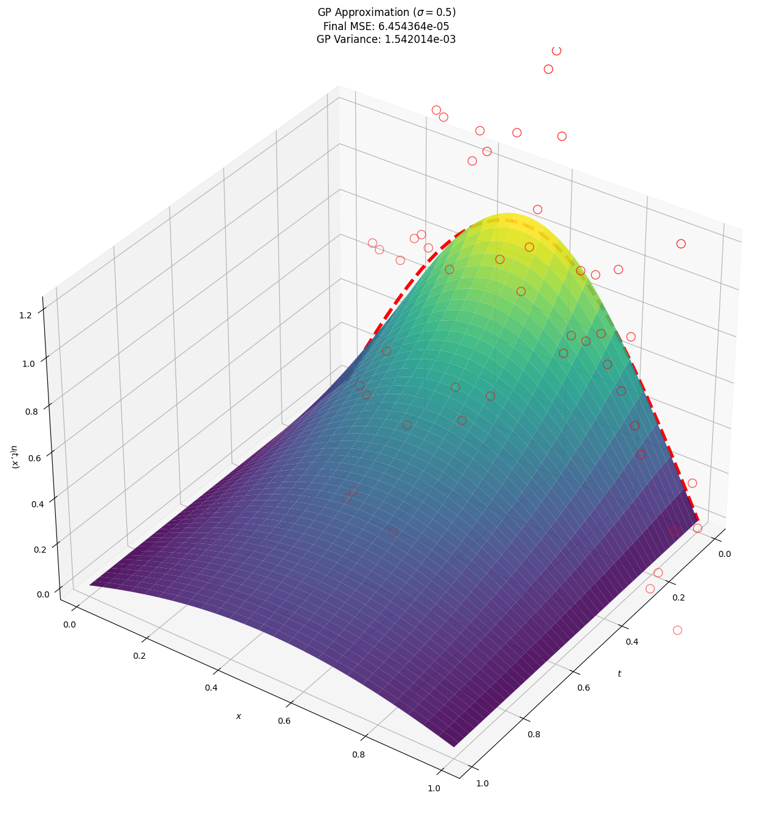
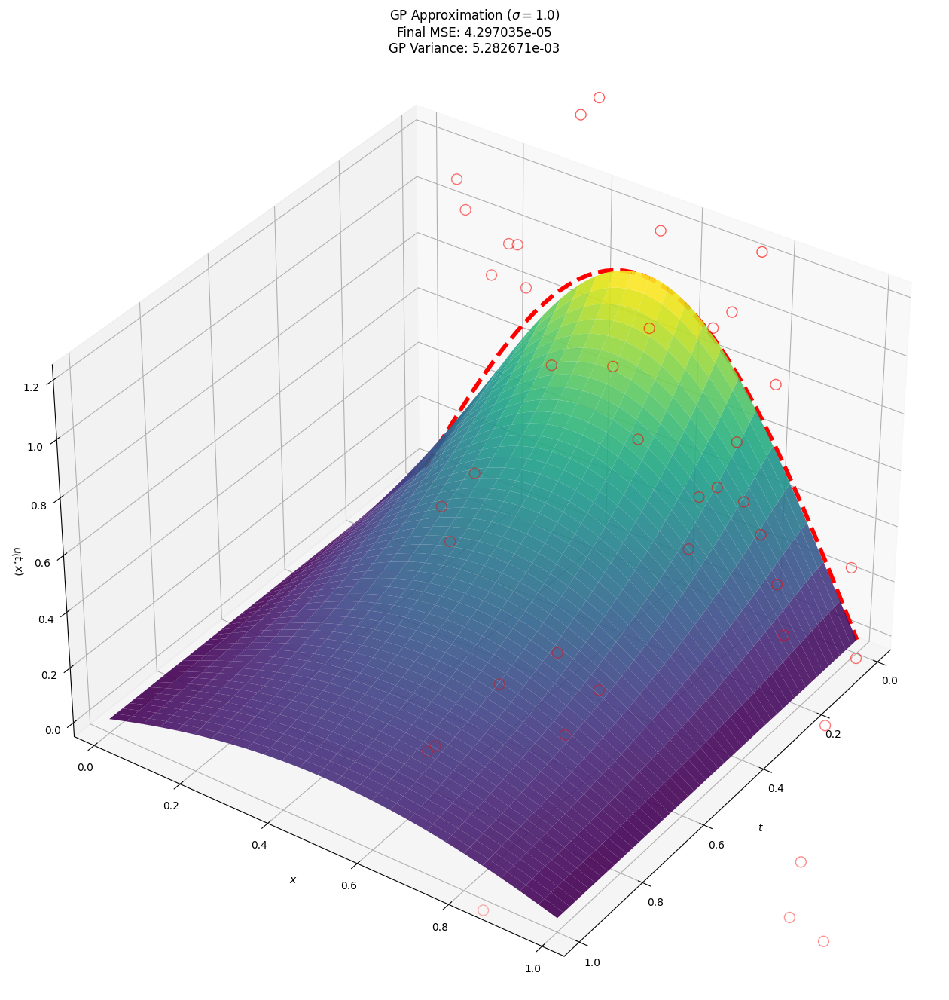
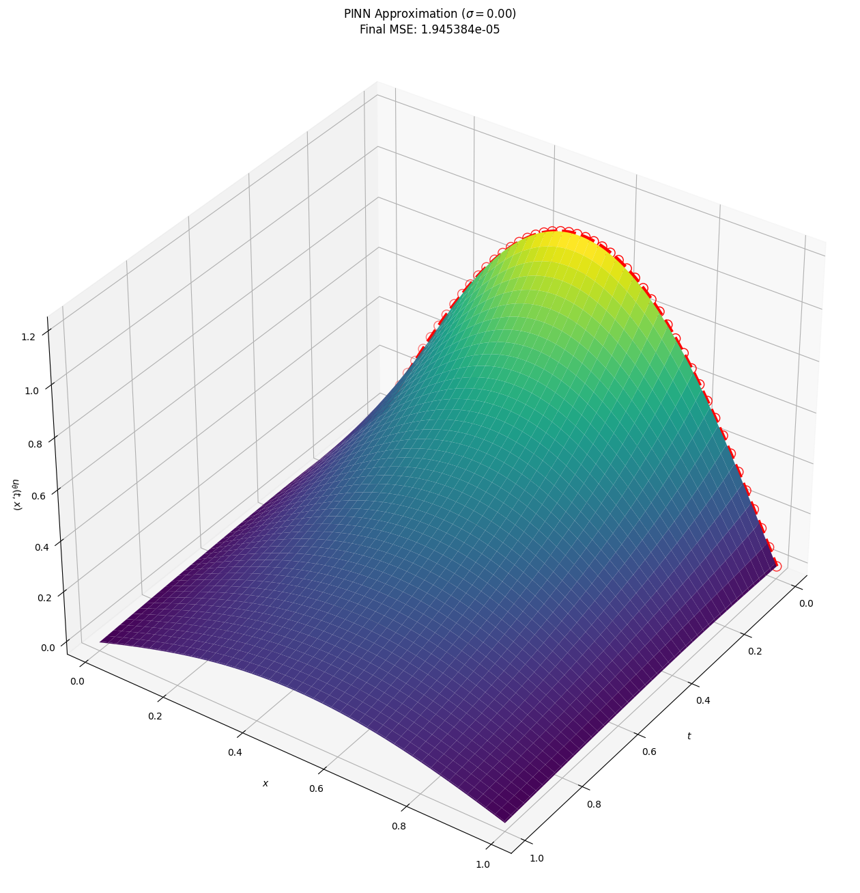
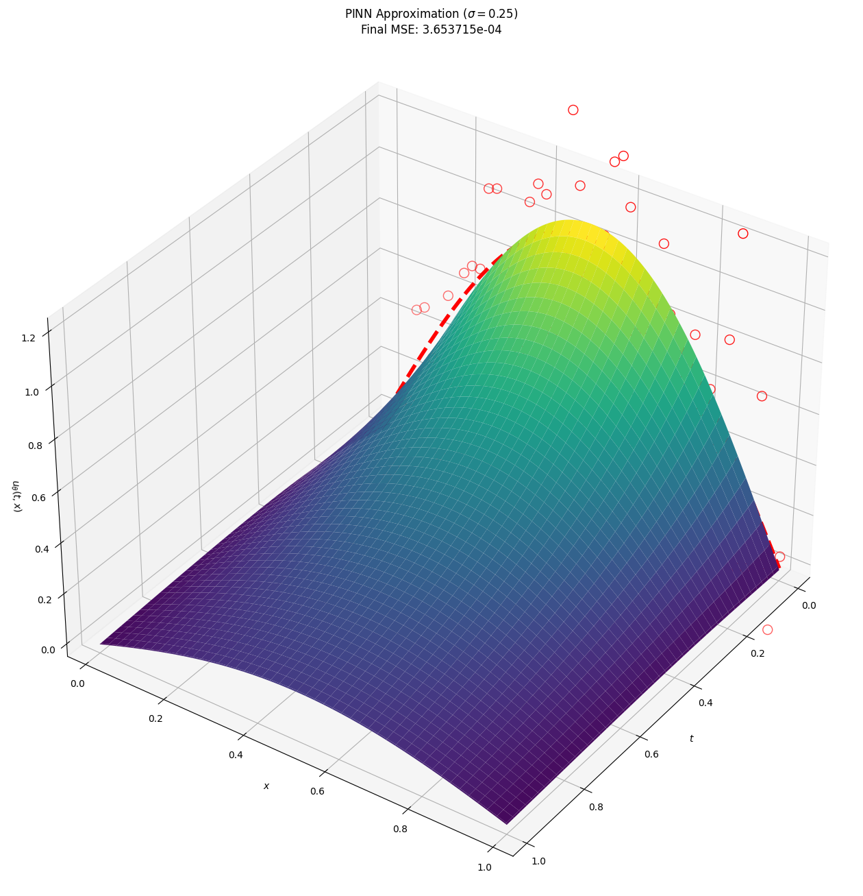
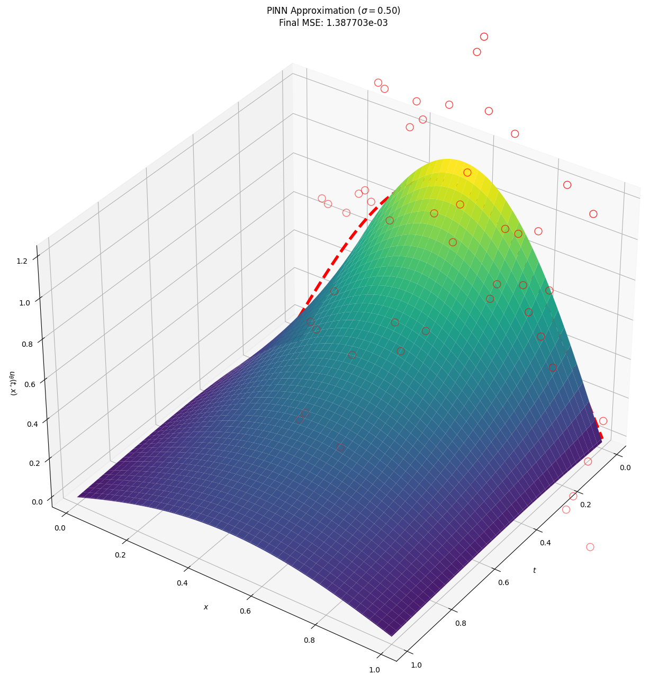
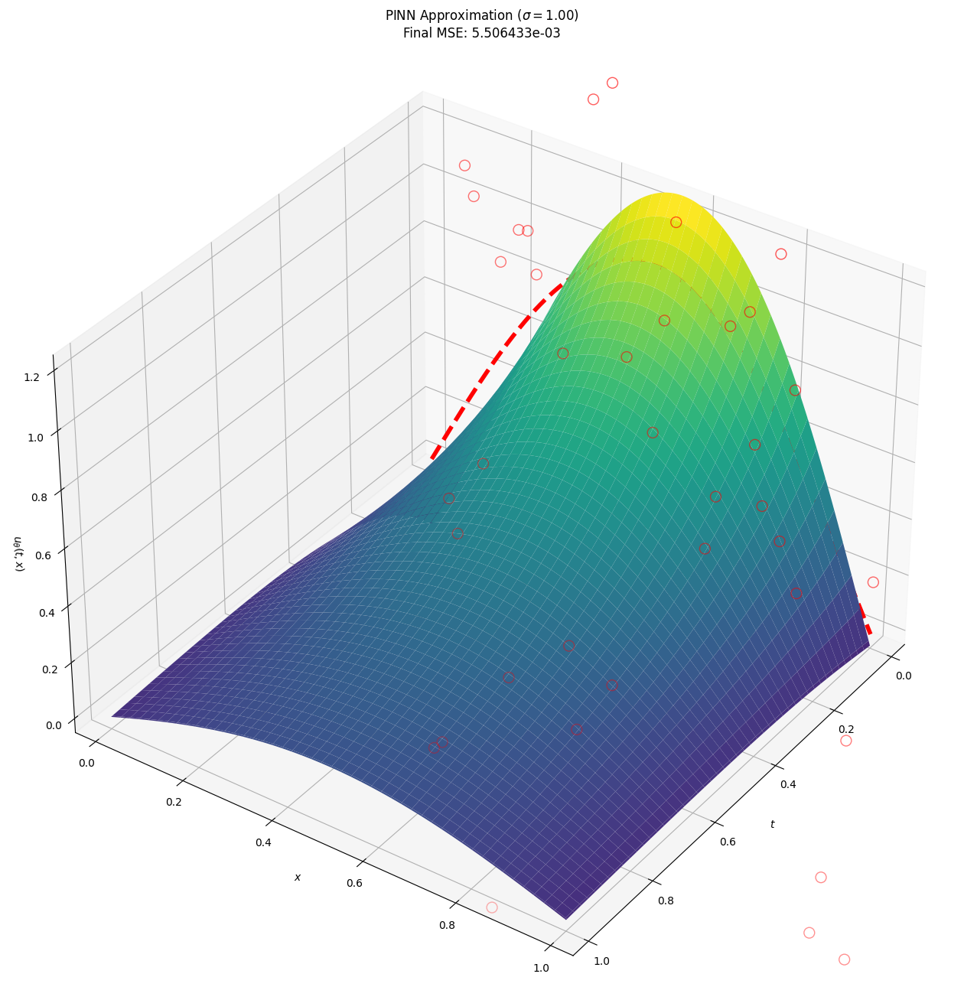

# GaussianProcessPDEs

Gaussian Processes for Bayesian Modeling of Solutions to Partial Differential Equations – Final Project for CS 6362: Advanced Machine Learning

This repository contains a custom PyTorch GPU implementation to train a numerical GP (using backward Euler scheme) to model solutions to the one-dimensional heat equation. Also contains a PINN implementation for performance benchmarking purposes.

## 1D Heat Equation

The particular PDE considered is defined for $t\in[0,1]$ and $\Omega = [0,1]$:
$$\partial_t u(t, x) = 0.2 \partial_{xx} u(t,x), \qquad (t,x)\in (0,1] \times \Omega $$
$$u(0, x) = \sin(\pi x), \qquad x\in \Omega$$
$$u(t, 0) = u(t,1) = u_b(t,x) \equiv 0, \qquad (t, x) \in (0, T] \times \partial \Omega.$$

The PDE admits the following solution:
$$u^*(t, x) = e^{(-0.2\pi^2 t)}\sin(\pi x).$$

## Results

### Gaussian Process

 

|  |  |
| --- | --- |
|  |  |

### PINN

|  |  |
| --- | --- |
|  |  |
